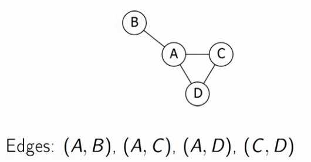
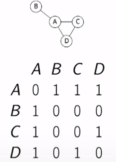
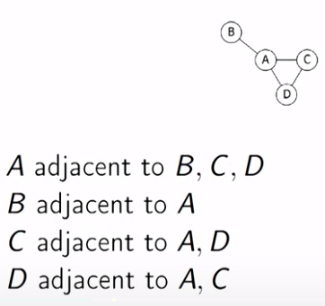
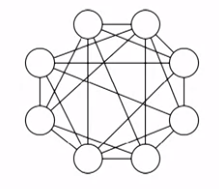
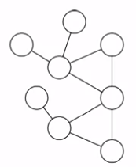
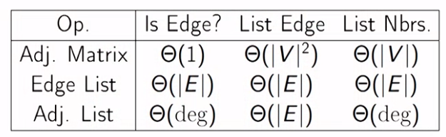

# Graphs

### Defination

An **undirected graph** is a collection V of vertices, and a collection E of edges each of which contain a pair of vertices.

* **Loop** connect vertex to itself.
* Graphs represent the connections between the objects.

#### Formal defination

A graph is an abstract data type which consist of the

* Vertices (or nodes).
* Edges connecting pair of vertices.

If a graph doesn't have a multiple edges or a loop its called a **simple graph**

### Representaion of the graph

1. **Edge List**

	+ Store all edges in for of list.

		 

	

2. **Adjacency Matrix**

	+ Create a matrix to store wheather there is the edge between two vertices.
	+ Entries are 1 if there is a edge between vertices and 0 if there is not.

		 

	

3. Adjacency List

	+ For each vertix, store the list of the adjancent vertices.

		 

	

#### Dense Graphs

In dense graphs, |E| = |$V^2$|

A large fractions of pairs of the vertices are connected by the edges.

#### Sparse Graphs

In dense graphs, |E| = |V|

Each vertex has onlyy a few edges.

#### Time period for different operations.

For many of the problems we want the adjaency list.

- Graph algorithms runtimes depend on the *number of the vertices* (|V|) and *number of the edges* (|E|).