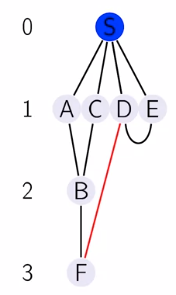

#### Path and the Lenghts

**Length** of the path L(P) is the number of the edges in the path.

L(D - E - S - A - B) = 4

#### Distance

The **distance** between two vertices is the length of the shortest path between them.

d(C, A) = 2
d(D, B) = 3

d(D, B) = 4
d(C, A) = inf

First we will study to find the distance of the given node from all the other node in the graph.

This can be achive by converted the graph to the distance layer.

For the directed graph:

The general property is that:

- There can't be any edge from a layer to another layer which is far from S by atleast two.
- There can be edge from one layer to another layer.
- There can be edge within the layer edges.
- There can be edge from a layer to any of the previous layers.

The distance from the top vertex to any other vertex is the layer number of that vertex.

This can be acchive by the *breadth first search*.
