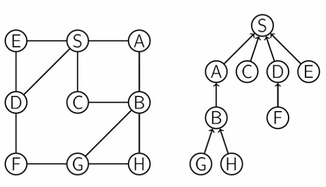

# Shortest Path Tree

**Shortest Path Tree** is the tree contaning all the nodes and with parent nodes.

In the given image, on left hand side there is a undirected graph and on the right there is the shortest path tree of the respected graph.




The shortest path tree is indeed a tree, i.e. it doesnt cantain the cycles.


## Implementation

#### shortest_path_tree(G, s)

```

shortest_path_tree(G, s) {

	for all u in V: // for all nodes
		dist[u] = inf

		// prev stores node which is the parent of given node.
		prev[u] = NULL

	dist[s] = 0 // dist to store the distance/level of the nodes

	Q = {s} // Queue contanning all the discovered node.

	while Q is not empty:

		u = dequeue(Q)

		for all (u, v) in E: // For all edges start with u
			if dist[v] = inf:
				Enqueue(Q, v)
				dist[v] = dist[u] + 1
				prev[v] = u;

}

```

#### reconstruct_path(s, u, prev)

- s is the starting node
- u is the end node
- prev is the shortest path tree.

```

reconstruct_path(s, u, prev) {

	result = empty // DS to store the shortest path.

	// While end not equal to start.
	while u != s:
		result.append(u) // Append end
		u = prev[u] // end become prev of the end

	// The result will contain path from the u to s.
	// To find the path from s to u we will reverse the result.

	return Reverse(result)

}

```

**Running Time:** O(|E|+|V|)