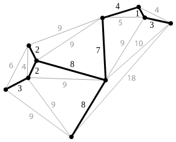

# Minimun Spanning Tree (MST)

#### Defination

A **minimum spanning tree (MST)** is a subset of the edges of a connected, edge-weighted undirected graph that connects all the vertices together,without any cycles and with the minimum possible total edge weight.

### Problem

**Input:**  A connected, undirected graph G with positive edge weights.

**Output:**  A subset of edges E' of minimum total weight such that the graph (V, E') is connected.

This problem can be solved by following 2 greedy algorithms:

- [Kruskal's Algorithm](kruskals_algorithm.md)
- [Prim's Algorithms](prims_algorithm.md)