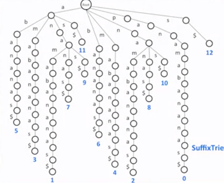
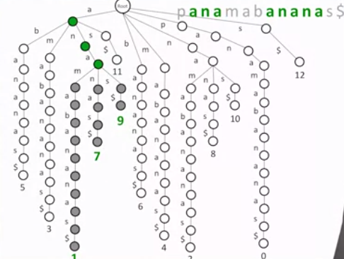

We see that the tire reprentation for the list of the pattren is not practicle.

To remove this problem we can use **suffix tire**.

##### Idea

- Add $ symbol to the end of the text.
- Generate all suffixes of the text.
- Generate a tire out of all suffix tire
- For each Pattren, check if it can be spelled out from the root downward in the suffix tire.

### Suffix Tire

The suffix tire of word *panamabananas$* is given below:

We can easily find the pattren using this suffix tree.

But there is no information of the position of the match or where does it.

To solve this problem :
- add leaf with the starting postion at the end of the branch.

Hence our suffix tree will look like this:

So to find the position of patten in the tire we continue down till there is the end of the tree ad return the position.

Given image gives the postion of the ana in the text panamabananas.

This method result in the faster searching but high memory consomption.

**Memory**: |text| . (|text| - 1) / 2