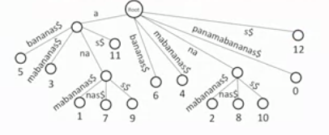
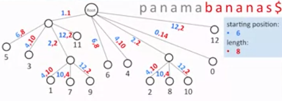

### Suffix Tree

To solve the memory consumption problem we compress all the non-branching edges into one.

This is called **suffix tree**.

One example is given below:

**Memory** : O(|Text|)

But here still there we need the to store the edge information of the suffix tree which will consume the same memory as the suffix_tire.

To solve this problem we can only store the starting position and the length of the string.

- The native algorithm for the construction of the suffix tree is **quadratic** runtime.
	- O( |Text|^2 )

- But there is a linear time algorithm called **Weiner algorithm** for the construction of the suffix tree.
	- O( |Text| )

### Resources Consumption

So in the end the total consumption of resources in pattren matching is:

- **Runtime:**  O( |Text| + |Pattrens|)
- **Memory:**  O(|Text|)