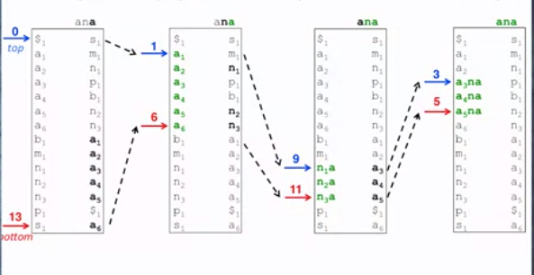
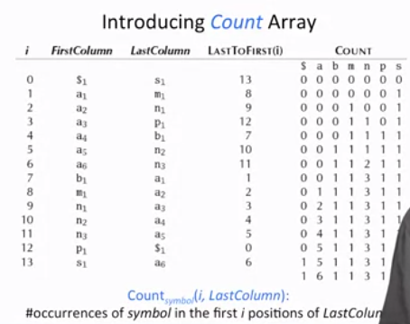

## Using BWT for Pattren Matching

We can use the BWT transformation of the text to find the specific pattren in the given text.

#### Steps

- Convert the given text into it's BWT form.
- Reverse the pattren to be found. Called it reversed_pattren.
- Use two pointer top and bottom and search for the first letter in the reversed_pattren to find the range of the pattren in the given string.
- Also, use two pointers *topIndex* and *bottomIndex* which specify the first and the last position of the symbol among positions from top to botton in the last column.
- Repeate the above steps till the pattren is found.


The given below the steps to find the pattren *ana* in text *panamabanana$*




#### Implementation

```

BW_Matching(first_column, last_column, pattren, LastToFirst) {

	top = 0
	bottom = |last_column| - 1

	while top <= bottom:

		if pattren is non empty:
			symbol = last letter in Pattren
			remove last pattern from Pattern

			if postion from top to bottom in last_column contains symbol:

				top_index = first position of the symbol among positions from top to botton in the last column.

				bottom_index = last position of the symbol among positions from top to botton in the last column.

				top = LastToFirst(top_index)
				bottom = LastToFirst(bottom_index)

			else
				return 0

		else
			return bottom - top + 1

}

```

- The function LastToFirst(index) define the position of the symbol in index in first column.

##### Probelem

- This algorithm is space-efficient but very time consumming.

- This algorithm checks all the symbols from top to bottom in last array in each steps.

- Also it doesnt describe the position of the pattren in the text.


The time of this algorithm can be improved by using the  **count array**.

The **count array** stores the occurence of the symbol in the i-th postion of the last column.



#### Better Impemnetation


```

BW_Matching(FirstOccurence, last_column, pattren, Count) {

	top = 0
	bottom = |last_column| - 1

	while top <= bottom:

		if pattren is non empty:

			symbol = last letter in Pattren
			remove last pattern from Pattern

			top = FirstOccurence(symbol) + count(top, last_column)
			bottom = FirstOccurence(symbol) + count(bottom + 1, last_column) - 1

			else
				return 0

		else
			return bottom - top + 1

}

```