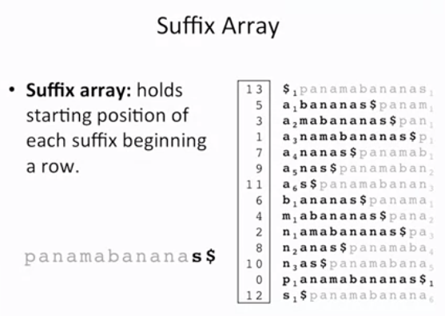

### Suffix Array

**Suffix array** holds the starting position of the each suffix begnning in the row.



Using the suffix array we can easily find the postion of the pattren in the text using BWT pattren finding algorithm.

</br>

- **Native Implementation** for the construction of the suffix array is quite time consumming.
	+ O(|Text| . log(|Text|) )

- However we can easily find the suffix array of text using the suffix tree using Depth First Travelsal.
	+ O(|Text|) time and ~20 * |Text| space.

- Manber-Myers algorithm:
	+ O(|Text|) time and ~4 * |Text| space.

### Pattren Matching With Suffix Array

```

Pattren_matching(Text, Pattren, SuffixArray) {

	minIndex = 0
	maxIndex = |Text|

	while minIndex < maxIndex:

		midIndex = (minIndex + maxIndex) / 2

		if Pattren > suffix of Text starting at position SuffixArray[midIndex]:
			minIndex += 1

		else
			continue

	start = minInex
	maxIndex = |Text|

	while minIndex < maxIndex:

		midIndex = (minIndex + maxIndex) / 2

		if Pattren < suffix of Text starting at position SuffixArray[midIndex]:
			maxIndex = midIndex

		else
			minIndex += 1

	end = maxIndex

	if start > end:
		return "Not Found"

	else
		return (start, end)

}

```