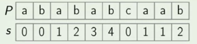

## Prefix Function

**Prefix Function** of a string P is a function s(i) that for each i returns the length if the longest border if prefix P[0...i].

##### Example



##### Lemma

- P[0...i] has a border of length s(i + 1) - 1.
	+ s(i + 1) <= s(i) + 1

- If s(i) > 0, then all borders of P[0...i] but for the longest one are also borders of P[0...s(i) - 1]
	+ All the borders of P[0..i] can be enumerated by taking the longest border b1 of P[0...i], then the longest border b2 of b1, then the londest border b3 of b2, .... , and so on.

### Implementing Prefix Function

##### Idea

- Make current border 0.
- Make s(0) = 0.
- Match the next chracter of the text with the next chracter in the border.
- If they are same, s(i + 1) = s(i) + 1. And update the border
- If they are different, find the longest border of the current border and compair the symbol with the next chracter of the this new border and repeat till match is found.

#### ComputePrefixFunction(P)

```

ComputePrefixFunction(P) {

	s = array of the integers of length |P|.

	s[0] = 0, border = 0

	for i from 1 to |P| - 1:

		while(border > 0) and (P[i] != P[border]):
			border = s[border - 1]

		if p[i] == P[border]:
			border = border + 1

		else:
			border = 0

		s[i] = border

	return s

}

```

**Running Time:** O(|P|)