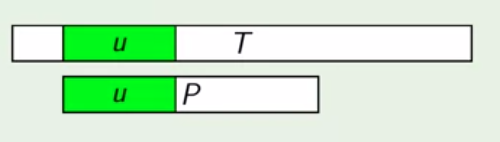
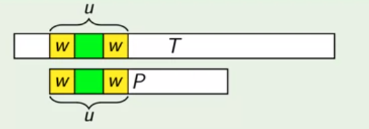
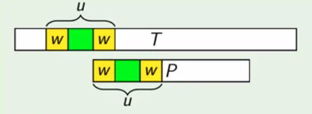

#### Border

**Border** of a strign S is a prefix of S which is equal to a suffix of S, bot not equal to whole S.

###### Examples:

- 'a' is a border of "arba".
- 'ab' is a border of "abcbab".
- 'abab' is a border of "ababab".
- 'ab'is not a border of "ab".

#### Pattren Shifting

##### Steps

- **Step 1:**  Find the longest common prefix u.

- **Step 2:**  Find w - the longest border of u.

- **Step 3:**  Move P such that prefix w in P aligns with suffix w of u un T.

#### Suffix notation

Donate by S<k> is the suffix of the string S starting at position k.

###### Examples

- S = "abcd" => S<2> = "cd".
- S = "abc" => S<0> = "abc".
- S = "aa" => S<1> = "a".

 

- Using the pattren shift method we can avoid the many possible comparisions which Brute Force Algorithm does.