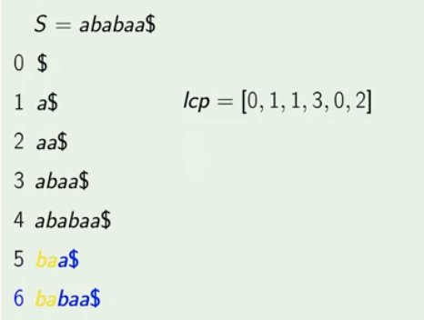

### Longest Common Prefix

The **longest common prefix** ('lcp') of two string S and T is the longest such string u that u is both a prefix of S and T. Donated by LCP(S, T) is the length of the "lcp" of S and T.

###### Example

- LCP("ababac", "abc") = 2
- LCP("a", "b") = 0


#### LCP Array

Consider suffix array A of string S in the rae form, that is

   A[0] < A[1] < A[2] < .... <A[|S| - 1]

are all suffix of S in lexiographical order.

Then **LCP Array** of string S is the array lcp of size |S| - 1  such that for each i such that 0 <= i <= |S| - 2,

   lcp[i] = LCP(A[i], A[i + 1])

###### Example




- For any i < j, LCP(A[i], A[j]) <= lcp[i] and LCP(A[i], A[j]) <= lcp[j - 1]

### LCP Array Construction

#### Idea

- Start by computing LCP(A[0], A[1]) directly.
- Instead of computing LCP(A[1], A[2]), move A[0] one position to right in the string, get some A[k] and compute LCP(A[k], A[k + 1])
- Repeat till LCP array is fully computed
- Length of the LCP never decreses by more then one each iteration.


#### Algorithm

- Compute LCP(A[0], A[1]) directly, save as lcp
- First suffix goes to the next in the string
- Second suffix is the next in the order
- Compute LCP knowing that first lcp - 1 chracters are equal, save lcp
- Repeat

#### Implementation

##### LCPofSuffixes(S, i, j, equal)

```

LCPofSuffixes(S, i, j, equal) {

	lcp = max(0, equal)

	while i + lcp < |S| and j + lcp < |S|:
		if S[i + lcp] == S[j + lcp]:
			lcp = lcp + 1

		else:
			break

	return lcp
}


```

##### InvertSuffixArray(order)

```

InvertSuffixArray(order) {

	pos = array of size |order|

	for i from 0 to |pos| - 1:
		pos[order[i]] = i

	return pos

}

```

##### ComputeSuffixArray(S, order)

```

ComputeSuffixArray(S, order) {

	lcpArrray = array of size |S| - 1

	lcp = 0

	posInOrder = InvertSuffixArray(order)
	suffix = order[0]

	for i from 0 to |S| - 1:
		orderIndex = posInOrder[siffix]

		if orderIndex == |S| - 1:
			lcp = 0
			suffix = (suffix + 1) mod |S|
			continue

		nextSuffix = order[orderIndex + 1]
		lcp = LCPofSuffixes(S, suffix, nextSuffix, lcp - 1)
		lcpArray[orderIndex] = lcp
		suffix = (suffix + 1) mod |S|

	return lcpArray

}

```

**Running Time:** O(|S|)