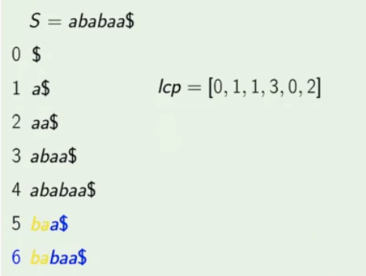

### Longest Common Prefix

The **longest common prefix** ('lcp') of two string S and T is the longest such string u that u is both a prefix of S and T. Donated by LCP(S, T) is the length of the "lcp" of S and T.

###### Example

- LCP("ababac", "abc") = 2
- LCP("a", "b") = 0

#### LCP Array

Consider suffix array A of string S in the rae form, that is

   A[0] < A[1] < A[2] < .... <A[|S| - 1]

are all suffix of S in lexiographical order.

Then **LCP Array** of string S is the array lcp of size |S| - 1  such that for each i such that 0 <= i <= |S| - 2,

   lcp[i] = LCP(A[i], A[i + 1])

###### Example

- For any i < j, LCP(A[i], A[j]) <= lcp[i] and LCP(A[i], A[j]) <= lcp[j - 1]