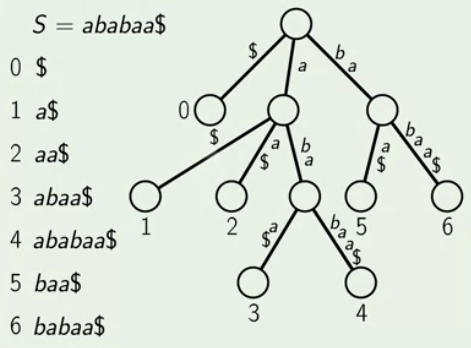

## Suffix Tree

**Input:** String S
**Output:** Suffix Tree of S

## Suffix Array And Suffix Tree



#### ALgorithm

- Build suffix array and LCP array
- Start from only root vertex
- Grow first edge for the first suffix
- For each next suffix, go up from the leaf until LCP with prevoius is below
- Build a new edge for the new suffix

**No of edges:** O(|S|)


##### class SuffixTreeNode:

```

class SuffixTreeNode:

	SuffixTreeNode parent
	Map<char, SuffixTreeNode> children
	integer stringDepth
	integer edgeStart
	integer edgeEnd

```

##### CreateNewLeaf(node, S, suffix)

```

CreateNewLeaf(node, S, suffix) {

	leaf = new SuffixTreeNode(
		children = {},
		parent = node,
		stringDepth = |S| - suffix,
		edgeStart = suffix + node.stringDepth,
		edgeEnd = |S| - 1)

	node.childern[S[leaf.edgeStart]] = leaf

	return leaf

}

```

##### BreakEdge(node, S, start, offset)

```

BreakEdge(node, S, start, offset) {

	startChar = S[start]
	midChar = S[start + offset]
	midNode = new SuffixTreeNode(
		children = {},
		parent = node,
		stringDepth = node.stringDepth + offset,
		edgeStart = start,
		edgeEnd = start + offset + 1)

	midNode.childern[midChar] = node.childern[startChar]
	node.children[startChar].parent = midNode
	node.children[startChar].edgeStart += offset
	node.children[startChar] = midNode

	return midNode

}

```


##### STfromSA(S, order, lcpArray)

```

STfromSA(S, order, lcpArray) {

	root = new SuffixTreeNode (
		children = {}, parent = nil, stringDepth = 0,
		edgeStart = -1, edgeEnd = -1)

	lcpPrev = 0
	curNode = root

	for i from 0 to |S| - 1:
		suffix = order[i]

		while curNode.stringDepth > lcpPrv:
			curNode = curNode.parent

		if curNode.srtingDepth == lcpPrev:
			currNode = CreateNewLeaf(curNode, S, suffix)

		else:
			edgeStart = order[i - 1] + curNode.stringDepth
			offset = lcpPrev = curNode.stringDepth
			midNode = BreakEdge(curNode, S, edgeStart, offset)
			curNode = CreateNewLeaf(midNode, S, suffix)

		if i < |S| - 1:
			lcpPrev = lcpArray[i]

		return root

}

```

**Running Time:** O(|S|.log(|S|))