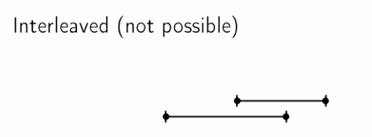

# Exploring graphs

## Paths

## Defination

A path in a graph G is a sequence of the vertices v0, v1, ...  that for all i, (v<i>, v<i + 1>) is an edge of the G.

### Rechability

**INPUT :** Graph G and vertex s
**OUTPUT :** The collection of the vertices v of the G so that there is a path from s to v.

Find which vertix in G are rechable from others.

##### Components(s)

```

Components(s) {

	DiscoveredNodes = [s]

	while there is an edge e leaving DiscoveredNodes that has not been explored: // Explore(v)
		add vertex at the other end of the e to DiscoveredNodes

	return DiscoveredNodes

}

```

To keep track of the vertices found:
Give exch vertix boolean variable visited(v).

Keep a list of the vertices with edges left to check.
This will end up getting hidden in the program stack.

We will explore new edges in depth first order.

 Explore function find all the vertices which can be reached by the given ndoe.

#### Explore(v)

```

Explore(v) {

	visited(v) = true

	previsit(v)

	for (v, w) in E:  // E is the list of the edges.
		if not visited(w):
			Explore(w)

	postvisit(v)

}

```

For explore to work we need adjancency list representation.


If we want to explore all the vertices in the graph we use **depth first search**

#### DFS(G)

```

DFS(G) {

	for all v in V:
		mark v unvisited

	for v in V:
		if not visited(v):
			Exlpore(v)

}

```

*Previsit* and *Postvisit* numbers tell us about the execusion of the DFS.

For any vertices u, v the intervals [pre(u), post(u)] and [pre(v), post(v)] are either nested or disjoint.





Assume that u visited before v. Then there are two possible cases:

* We find v while exploring u (u become ansestor of v) (post(u) > post(v))
* We find v after exploring u (u become cousin of v) (post(u) < pre(v))

##### Runtime

	DFS(G): O(|V| + |E|) // Linear Time Search


## Connectivity

##### Theorm

The vertices of a graph G can be partitioned into **connected components** so thet v is rechable from w if and onoy if they are in same connected component.

### Connected Components

**Input:** Graph G
**Output:**  The connected conponents of G.

#### Explore(v)

```

Explore(v) {

	visited(v) = true

	CCnum(v) = cc // Lable each connected component differently.

	previsit(v)

	for (v,w) in E:
		if not visited(w):
			Explore(w)

	postvisit(v)

}

```

#### DFS(G)

```

DFS(G) {

	for all v in V:
		mark v unvisited

	cc = 1

	for v in V:
		if not visited(v):
			Explore(v)
			cc = cc + 1

}

```

##### Runtime

	DFS(G): O(|V| + |E|) // Linear Time Search

#### Preorder(v)

```

Preorder(v) {
	pre(v) = pr

	pr = pr +1

}

```

#### Postorder(v)

```

Postorder(v) {
	pre(v) = po

	po = po +1

}

```